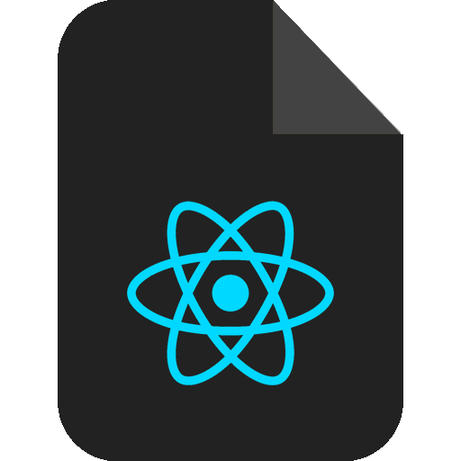
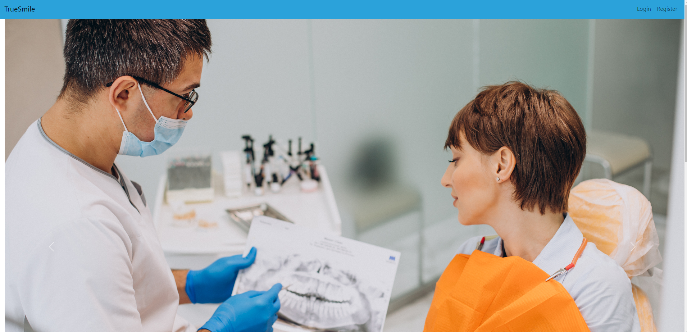
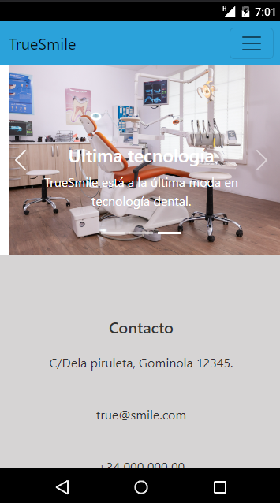
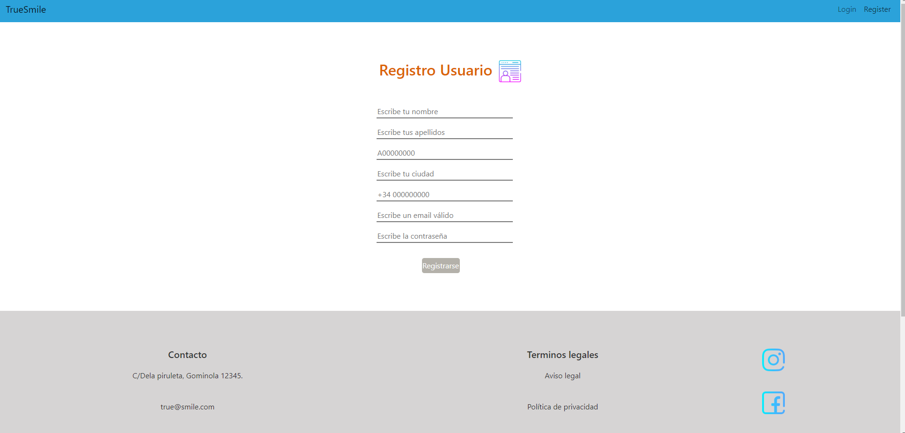
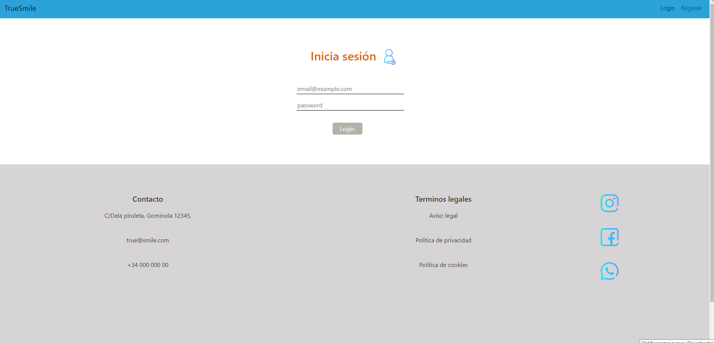
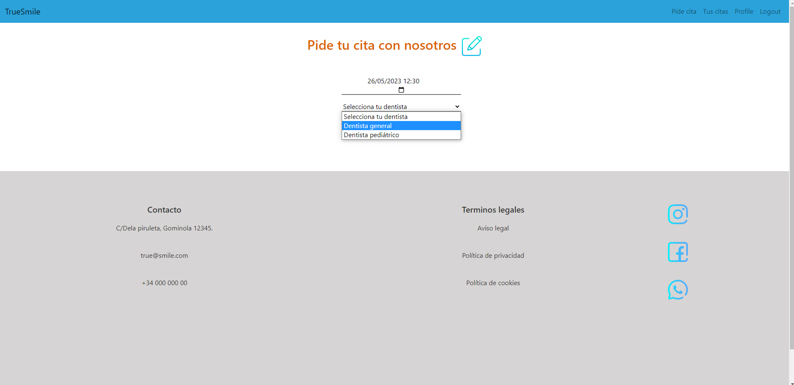
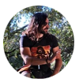

<h1 align="center"> Clínica-TrueSmile </h1>

<details>
  <summary>Contenido 📝</summary>
  <ol>
    <li><a href="#objetivo">Objetivo</a></li>
    <li><a href="#sobre-el-proyecto">Sobre el proyecto</a></li>
    <li><a href="#deploy">Deploy</a></li>
    <li><a href="#stack">Stack</a></li>
    <li><a href="#futuras-funcionalidades">Futuras funcionalidades</a></li>
    <li><a href="#licencia">Licencia</a></li>
    <li><a href="#webgrafia">Webgrafia</a></li>
    <li><a href="#desarrollo">Desarrollo</a></li>
    <li><a href="#agradecimientos">Agradecimientos</a></li>
    <li><a href="#contacto">Contacto</a></li>
  </ol>
</details>

## Objetivo 🎯
Este proyecto requería conexión a una <a href="https://github.com/PaulaRibelles/Clinica-TrueSmile">base de datos</a> creada anteriormente y usar react para crear una web.

## Sobre el proyecto 🔎
Esta web está pensada para gestionar las citas entre paciente y doctores en una clínica dental, en este caso llamada TrueSmile. De este modo, los clientes van a poder registrarse, logearse, ver su perfil de usuario y crear citas con la especialidad del doctor que deseen. 
  
## Deploy 🚀
<div align="center">
   🚀 <a href="https://geekshubs-fsd-clinica-react-15032023.vercel.app/"><strong>Url a producción </strong></a>🚀
</div>

## Stack :paperclip:

Tecnologías utilizadas:

<div>
<a href="https://react.dev/">
    
</a>

</a>
<a href="https://developer.mozilla.org/es/docs/Web/JavaScript">
    
</a>
 </div>

## Vistas :eyes:
 
<h4>Home</h4>

<h4>Home mobile</h4>

<h4>Register</h4>

<h4>Login</h4>

<h4>Pedir cita</h4>


## Futuras funcionalidades :pencil:
<p>Vista actualizar y/o eliminar perfil </p>
<p>Vista actualizar y/o eliminar citas </p>

## Contribuciones :mailbox:
Las sugerencias y aportaciones son siempre bienvenidas.  

Puedes hacerlo de dos maneras:

1. Abriendo una issue
2. Crea un fork del repositorio
    - Crea una nueva rama  
        ```
        $ git checkout -b feature/nombreUsuario-mejora
        ```
    - Haz un commit con tus cambios 
        ```
        $ git commit -m 'feat: mejora X cosa'
        ```
    - Haz push a la rama 
        ```
        $ git push origin feature/nombreUsuario-mejora
        ```
    - Abre una solicitud de Pull Request

## Licencia :scroll:
Este proyecto se encuentra bajo licencia de MIT License

## Webgrafia :books:
Para conseguir el objetivo hemos recopilado información de:

- <a href="https://react.dev/">React</a>

- <a href="https://react.dev/">Bootstrap-React</a>

- <a href="https://stackoverflow.com">Stackoverflow</a>

## Agradecimientos :sparkles:

 A los compañeros de Geekshubs València por encontrar siempre un minuto para ayudarme. 

<div>

- <a href="https://github.com/s0usaa">David Soto</a>
</div>
<div>

- <a href="https://github.com/alvarito101093/">Álvaro Bernabé</a>
</div>
<div>

- <a href="https://github.com/IgnacioFurio">Ignacio Furió</a>
</div>
<div>

- <a href="https://github.com/ilkogarcia">Ilko García</a>
</div>

## Contacto :email:

· Paula Ribelles: ricam.paula@gmail.com
